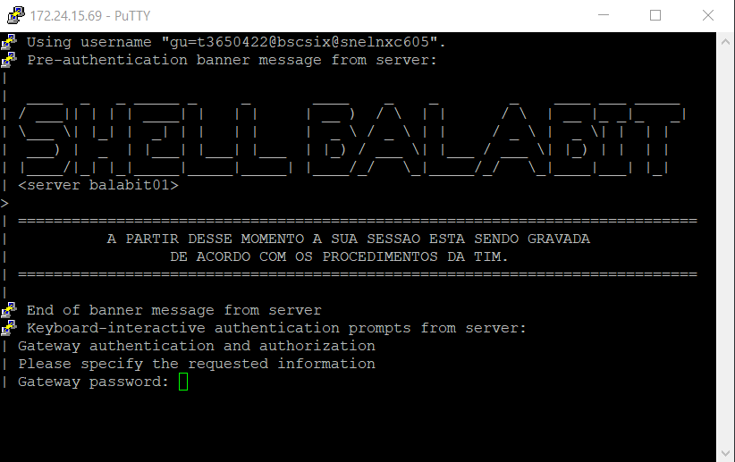

# Como acessar o BSCSIXT1

Documentacao para acessar a base da T1.

## BSCSIXT1

Como acessar o BSCSIXT1.
- Você precisa ter o email da tim. ex: "T00000@timbrasil.com.br".
- Cadastrar esse email no aplicativo [Microsoft Authenticator](https://www.microsoft.com/pt-br/security/mobile-authenticator-app) no celular.
- Baixar o [Putty](https://www.chiark.greenend.org.uk/~sgtatham/putty/latest.html) no computador.
- Baixar o [SQL Developer](https://www.oracle.com/database/sqldeveloper/technologies/download/) no computador.
- Baixar o arquivo "tsnames". [Link para Download](https://ericsson-my.sharepoint.com/:f:/r/personal/matheus_tanaka_ericsson_com/Documents/tsnames?csf=1&web=1&e=Bnmp83).

### Configurando o Microsoft Authenticator

<p>
Para configurar o microsoft authenticator no celular, é necessário ter o email da TIM como citado acima. Em seguida, você irá se deparar com uma lupa de pesquisa, onde ao lado dela vai ter 3 pontos na lateral do cabeçalho.
</p>

<p>
Você irá selecionar os 3 pontos e clicar na opção adicionar conta. Em seguida selecione a opção de "Conta Copororativa ou de Estudante", e escolha entre entrar com o email ou ler um código QR CODE.
</p>

<p>
Com o authenticator configurado, o próximo passo é configurar o Putty.
</p>

## Configurando o PUTTY

### Adicionando o IP

<p>
Siga o passo a passo da imagem para configurar.
</p>


- HostName (or IP address) -> 172.24.15.69
- Port -> 22

### Adicionando o Tunnel

Selecione a opção de "Connection -> SSH -> Tunnels" como na imagem abaixo.


<p>Em seguida adicione os seguintes dados nos campos selecionados</p>


- Source Port: 1500
- Destination: 10.171.253.170:1521

### Adicionando o Login da TIM

Em seguinda, selecione a opção de "Data" e coloque o seu email da TIM para realizar o login no ballabit.


<p>
Você precisa manter o padrão "gu=t0000000@bscsix@snelnxc605"
e substituir somente o "t0000000" pela matrícula que a TIM te enviar.
</p>

<p>
Com os campos adicionados, não esqueça de voltar para "Session" e criar um nome para a sessão e salvar.
</p>

### Acessando o ShellBalabit



<p>
Você deve encontrar uma tela parecida com está acima e em seguida será necessário colocar a senha do email da TIM "T00000@timbrasil.com.br" que você cadastrou.
</p>

- Gateway password: senha do email "T00000@timbrasil.com.br"

<p>
Em seguinda, você irá receber uma notificação no aplicativo do Authenticator para liberar acesso.
</p>

<p>
O próximo passo é inserir a senha da máquina.
</p>


- Senha do ballabit: hL6q6qL#

<p>
Pronto, agora você está dentro do BSCSIXT1! 
</p>

## Configurando o SQL Developer

<p>
Para acessar o BSCSIXT1 no SQL Developer, é necessário estar com o putty conectado. Caso contrário, não será possível acessar o banco de dados.
</p>

<p>
Próxima etapa é adicionar o arquivo "tnsnames" na pasta do SQL Developer, como na imagem a seguir.
</p>


<p>
Com o arquivo adicionado na pasta, próximo passo é configurar o acesso no SQL Developer, abra seu aplicativo e clique no "+" para criar uma nova conexão.
</p>


<p>Siga a imagem a seguir para adicionar os dados em seus respectivos campos</p>


- Name: BSCSIXT1
- Nome de Usuário: SYSADM
- Senha: SYSADM
- Tipo de Conexão: Básico
- Nome do Host: localhost
- Porta: 1500
- Nome do Serviço: BSCSIXT1

<p>
Clique em "Conectar", se tudo der certo, deve retornar com uma nova guia para testar o banco dados.
</p>

- Execute este comando para testar.

```SQL
SELECT * FROM customer_all;
```