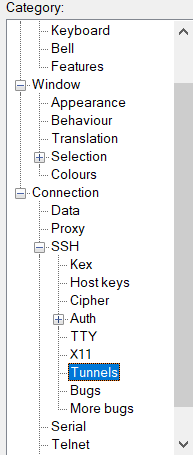
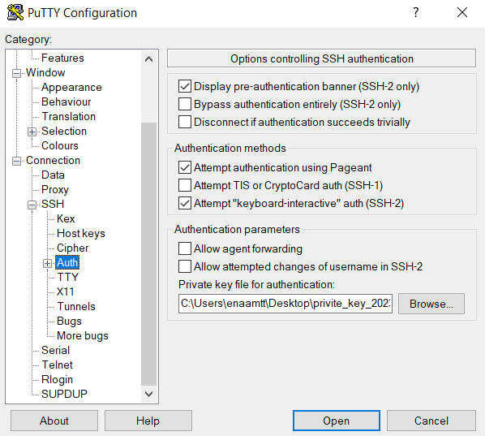

# Configurando o SQL Developer

<p>
Para acessar o banco de dados do Oracle no SQL Developer, é necessário criar uma nova "Session" no Putty.
</p>

## Adicionando o IP

<p>
Siga o passo a passo da imagem para configurar.
</p>


- HostName (or IP address) -> oracle@144.22.43.193
- Port -> 22

## Adicionando o Tunnel

Selecione a opção de "Connection -> SSH -> Tunnels" como na imagem abaixo.



<p>Em seguida adicione os seguintes dados nos campos selecionados</p>


- Source Port: 1500
- Destination: 144.22.43.193:1521

## Adicionando a private Key

Em seguinda, selecione a opção de AUTH e coloque o path do arquivo de private key (o arquivo está anexado no repositório, é só fazer o download).



<p>
Só clicar em open que você será redirecionado para o OracleDB. OBS: Não esqueça de salvar a conexão no PUTTY.
</p>

# Acessando o Oracle DB


<p>Siga a imagem a seguir para adicionar os dados em seus respectivos campos</p>


- Name: EB23
- Nome de Usuário: SYSADM
- Senha: SYSADM
- Tipo de Conexão: Básico
- Nome do Host: localhost
- Porta: 1500
- Nome do Serviço: EBSCSDB

<p>
Clique em "Conectar", se tudo der certo, deve retornar com uma nova guia para testar o banco dados.
</p>

- Execute este comando para testar.

```SQL
SELECT * FROM customer_all;
```