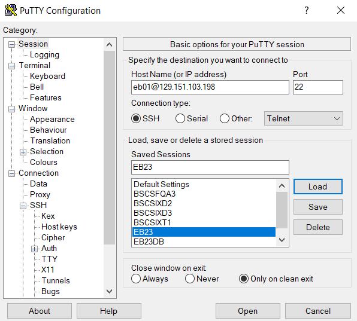
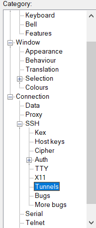
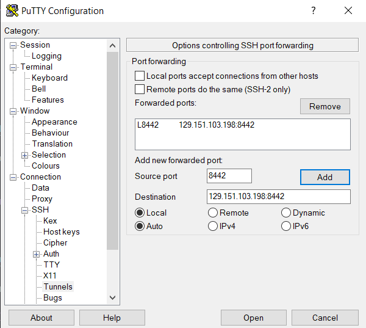
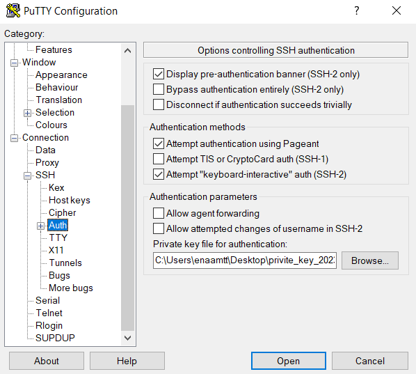

# Como acessar o EB23 no Putty

Como acessar o EB23 no Putty. 
- Você precisa ter o arquivo da private key. [Link para download](https://ericsson-my.sharepoint.com/:u:/r/personal/matheus_tanaka_ericsson_com/Documents/eb23-sshkey/privite_key_20230202.ppk?csf=1&web=1&e=zLSXS7).
- Baixar o [Putty](https://www.chiark.greenend.org.uk/~sgtatham/putty/latest.html) no computador.
- Baixar o [SQL Developer](https://www.oracle.com/database/sqldeveloper/technologies/download/) no computador.

# Configurando o PUTTY

## Adicionando o IP

Siga o passo a passo da imagem para configurar.

- HostName (or IP address) -> eb01@129.151.103.198
- Port -> 22

## Adicionando o Tunnel

Selecione a opção de "Connection -> SSH -> Tunnels" como na imagem abaixo.

Em seguida adicione os seguintes dados nos campos selecionados

- Source Port: 8442
- Destination: 129.151.103.198:8442

## Adicionando a private Key

Em seguinda, selecione a opção de AUTH e coloque o path do arquivo de private key (o arquivo está anexado no repositório, é só fazer o download).

# Acessando o EB23

Só clicar em open que você será redirecionado para o EB23. OBS: Não esqueça de salvar a conexão no PUTTY.

# Configurando o Oracle-DB
[Configurando-SQL-Developer](Configurando-SQL-Developer.md)

# Acesso ao CX
[Acesso-CX](./Acesso-CX.md)